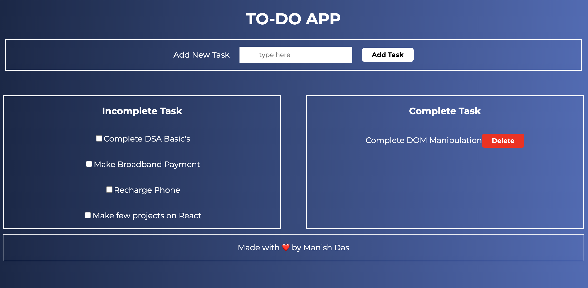

#Vanilla Javscript Todo App.

A complete todo application with all features.

**live demo: [https://To-Do-App.vercel.app/](https://to-do-app-one-pi.vercel.app/)**

---

### Made with ❤️ by [Manish Das](https://www.instagram.com/__manish_das__/)

## Tools Used

1. Favicon: [Flaticon.com](https://www.flaticon.com/)
1. Code Editor: [VS Code](https://code.visualstudio.com/)

---

## FAQ

### Q: Who the project is for?

The project is for the people who wanna get more skilled in `Javascript`.

---

## Feedback

If you have any feedback, please reach out to me at [@__manish_das__](https://instagram.com/__manish_das__)

## License

[MIT](https://choosealicense.com/licenses/mit/)

Happy Coding! 🚀